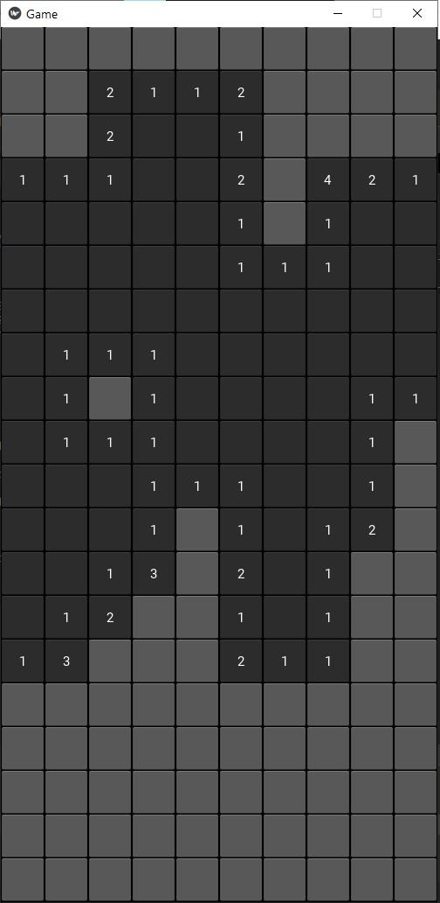

# Minesweeper-Kivy
A demo kivy app. Graph traversal using floodfill algorithm.

The main purpose is to explore kivy's framework and to know about packaging kivy's app to both desktop and android standalone app.



## Prerequisite
1. Python 3

## Setup
```
pip install --upgrade -r requirements.txt
```

only for Python 3.8+
```
pip install --pre --extra-index-url=https://kivy.org/downloads/simple kivy[base]
```

## Running
```
python main.py
```

## Packaging
### Windows executable
Double click `build.bat`, or run:
```
pyi-makespec --name minesweeper --icon=resource/icon.ico --add-data resource/*;. --onefile --noconsole main.py
python editspec.py -f=minesweeper.spec
pyinstaller --clean --noconfirm minesweeper.specpyinstaller minesweeper.spec
```

### Android
```
buildozer init
```
edit `buildozer.spec`, then run
```
buildozer android debug deploy run
```
device must be connected to pc, more info check https://kivy.org/doc/stable/guide/packaging-android.html
